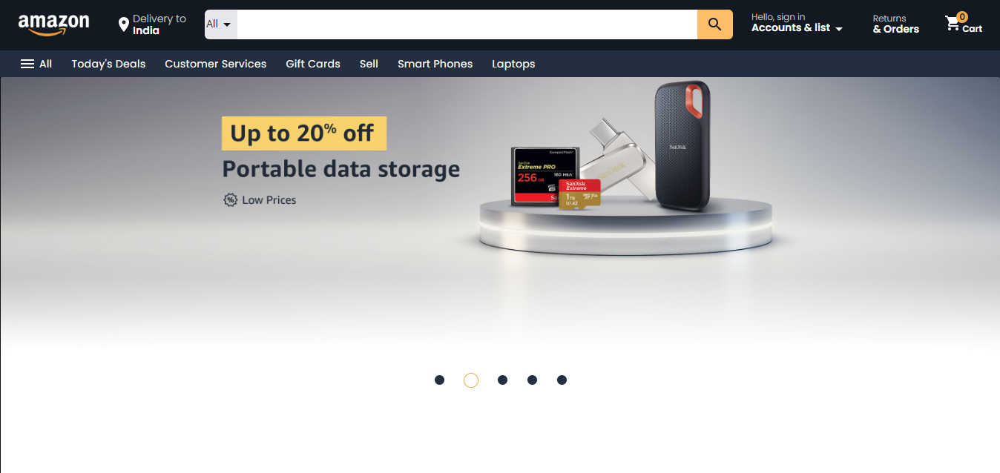
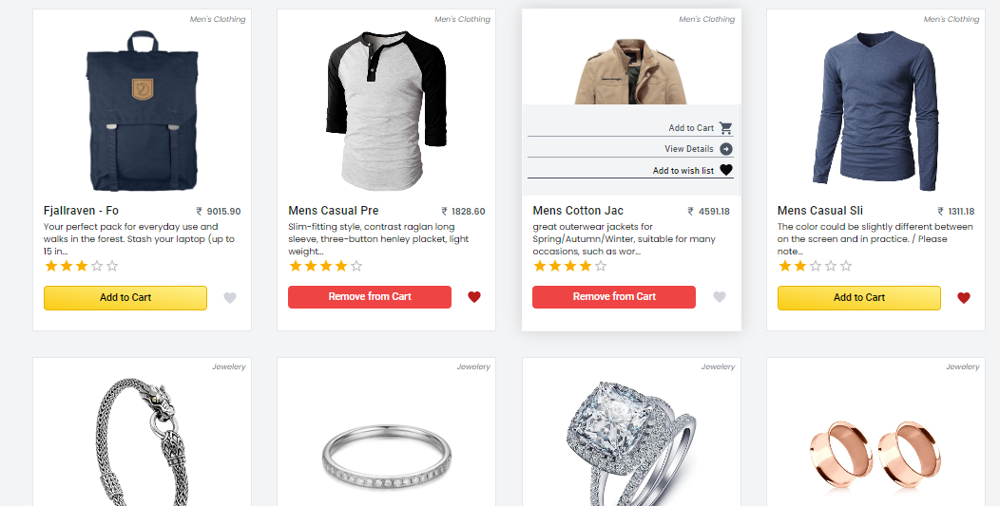
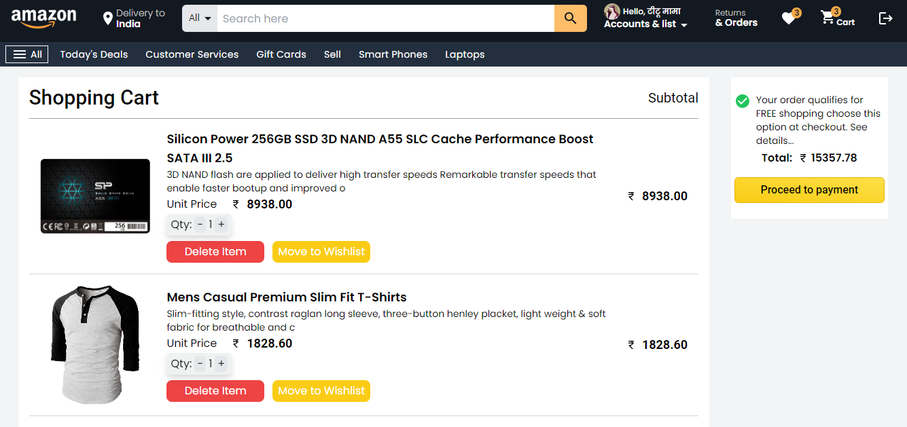
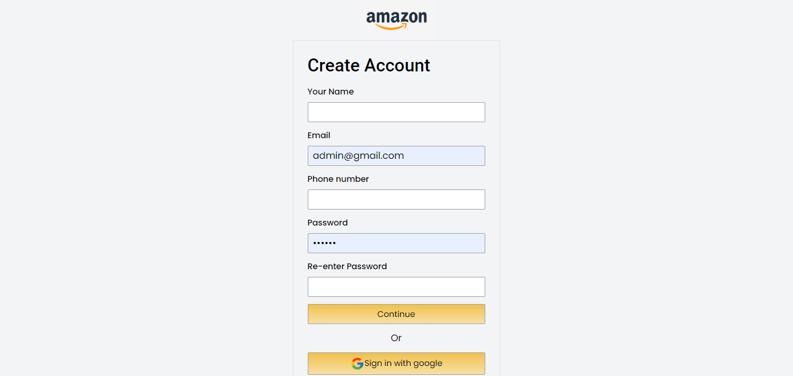
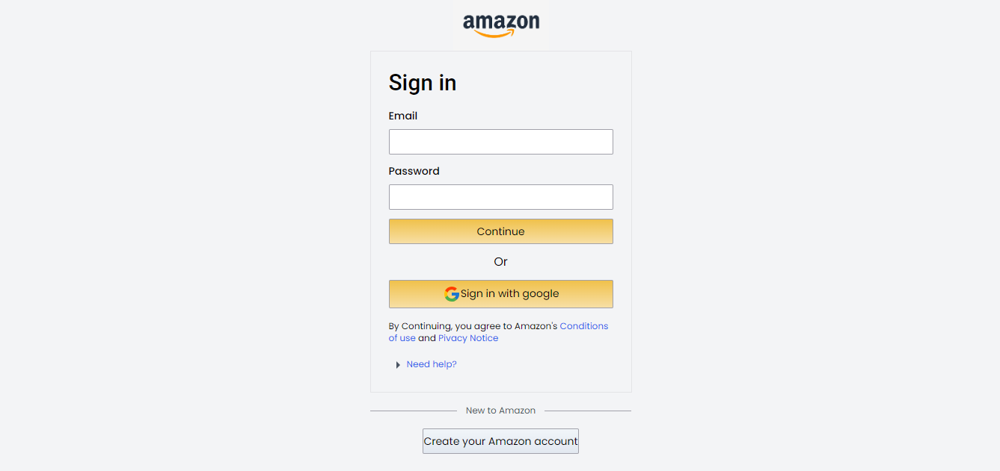
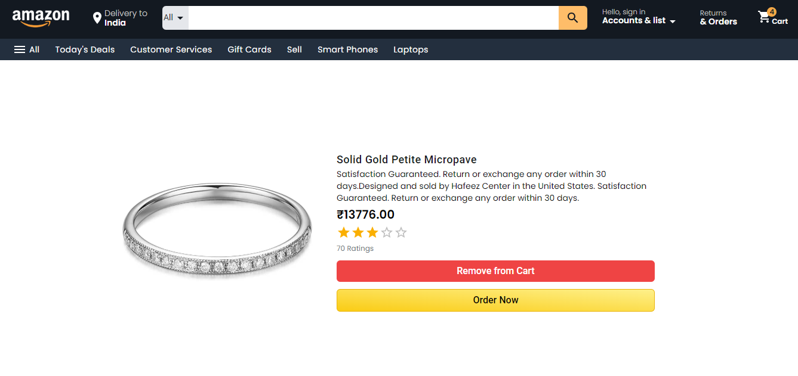
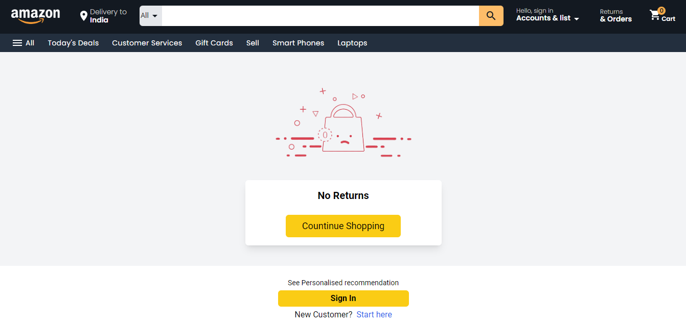

# Amazon Clone with React

This is a web application that replicates some of the core features of the Amazon website. It's built using React and Redux for state management, and it interacts with APIs for data retrieval and updates. The project also includes routing for seamless navigation between different pages.

## Table of Contents

- [Features](#features)
- [Demo](#demo)
- [Screenshots](#screenshots)
- [Installation](#installation)

## Features

The main features and functionalities of Amazon project are:

- Presist Storage
- User authentication (sign up, log in, log out)
- Browse and search products
- Add products to cart
- View order history

## Demo

Deployed link: https://amazonclonewebapp.netlify.app/

## Screenshots

Home Page

Cart

Sign Up and Sign In

Product Detail

Returns

## Installation

To run the project locally, follow these steps:

1. Clone the repository: `git clone https://github.com/anandprakash01/amazon-clone.git`
2. Navigate to the project directory: `cd amazon-project-directory`
3. Install dependencies: `npm install`
4. Run Project: `npm run dev`

Good luck with your project! 🚀
